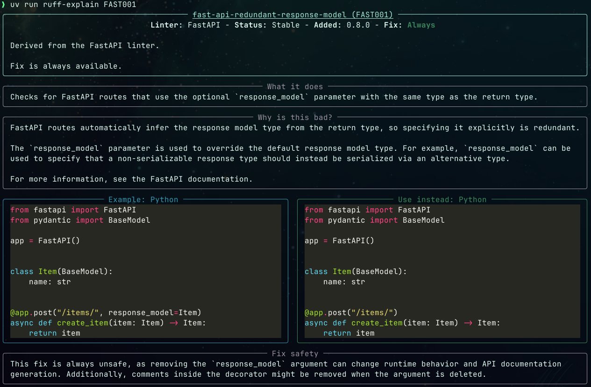

# ruff-explain

`ruff-explain` looks up Ruff rule documentation by rule ID and renders the docs page directly in your terminal with Rich.



## What it does

- Renders Ruff rule docs in the terminal by default.
- Opens the canonical docs page in your browser with `-o` / `--open`.
- Prints the installed version with `-v` / `--version`.
- Resolves rule IDs like `FAST001`, `F401`, and `ARG001` from a bundled rule map.
- Keeps the output focused on the actual rule content instead of full site chrome.

## Usage

```bash
uv run ruff-explain FAST001
uv run ruff-explain F401
uv run ruff-explain ARG001 -o
uv run ruff-explain --version
```

## Run from source

Run it from the repo with `uv`:

```bash
uv run ruff-explain FAST001
```

## Notes

- Default behavior is terminal rendering.
- `--open` skips rendering, opens the docs page immediately, and exits.
- `--version` prints the installed package version and exits.
- Unknown rule IDs return a non-zero exit code and show close matches when available.
